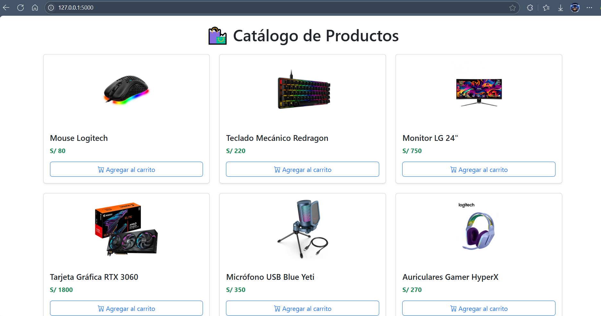
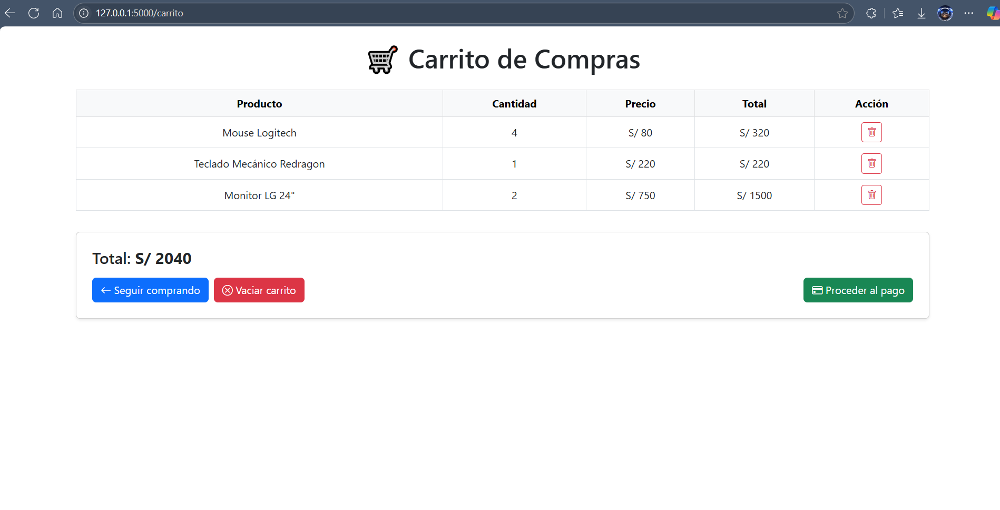
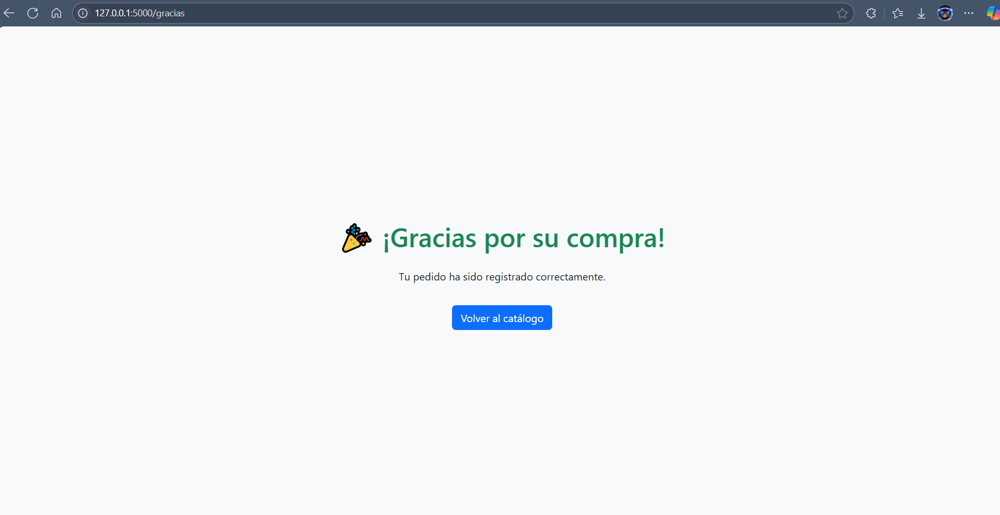

# 🛍️ Mini Tienda Virtual (Flask + Bootstrap)

**Mini Tienda Virtual** es un proyecto individual desarrollado para el curso de **Sistemas de Información**. Consiste en una tienda web básica que permite explorar productos, agregarlos al carrito, calcular el total y simular una compra, todo con un diseño moderno y responsive.

---

## 🚀 Funcionalidades

✅ Catálogo de productos con imagen, precio y nombre  
✅ Carrito de compras persistente en sesión  
✅ Suma automática del total general  
✅ Eliminar productos del carrito  
✅ Página de confirmación de compra  
✅ Diseño 100% responsive con Bootstrap 5  
✅ Íconos visuales con Bootstrap Icons

---

## 🌐 Tecnologías utilizadas

- **Python 3**
- **Flask** como framework backend
- **Bootstrap 5** para diseño responsivo
- **Bootstrap Icons**
- **Gunicorn** para despliegue (Render)
- **HTML5 + Jinja2** (templates Flask)

---

## 📷 Capturas de pantalla

### 🛍️ Catálogo  


### 🛒 Carrito de compras  


### ✅ Confirmación de compra  


---

## 📁 Estructura del proyecto


## 📦 Estructura del proyecto
```
└── 📁mini_tienda
    └── 📁capturas
        ├── carrito.png
        ├── catalogo.png
        ├── gracias.png
    └── 📁static
        └── 📁img
            ├── auriculares.png
            ├── gpu.png
            ├── laptop.png
            ├── microfono.png
            ├── monitor.png
            ├── mouse.png
            ├── teclado.png
            ├── webcam.png
    └── 📁templates
        ├── carrito.html
        ├── catalogo.html
        ├── gracias.html
    ├── app.py
    ├── Procfile
    ├── README.md
    └── requirements.txt
```


---

## 🚀 Despliegue

Este proyecto está listo para ser desplegado gratuitamente en [Render.com](https://render.com):

- Instala dependencias desde `requirements.txt`
- Usa `Procfile` con `gunicorn app:app`
- La app se ejecuta en `Flask` con entorno `production`

---

## 🧑‍💻 Autor

**Alvaro - Alvav2**  
© 2025
